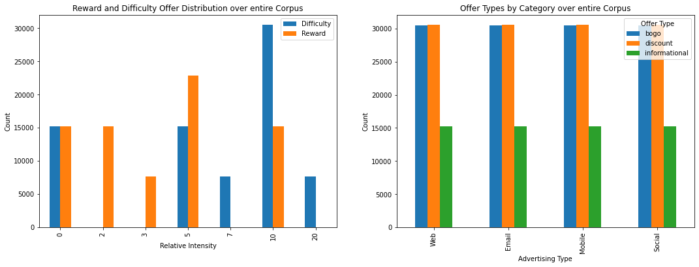
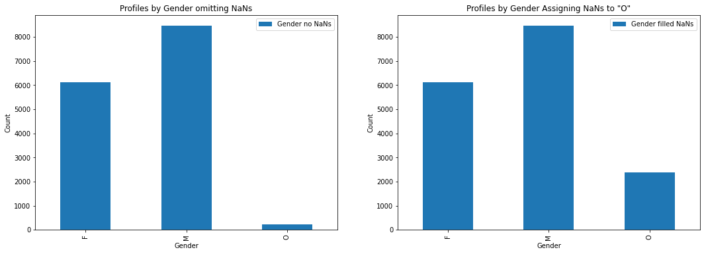
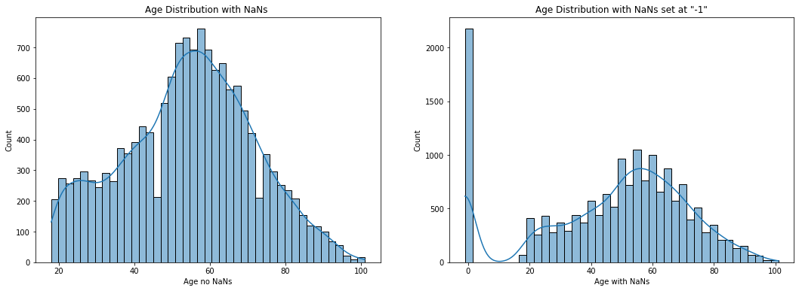
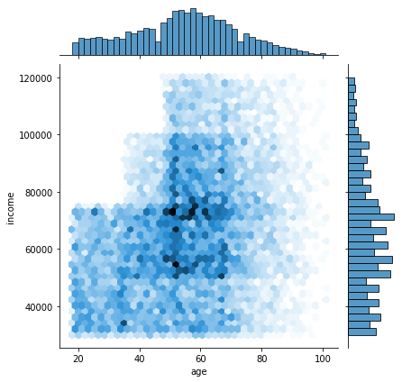
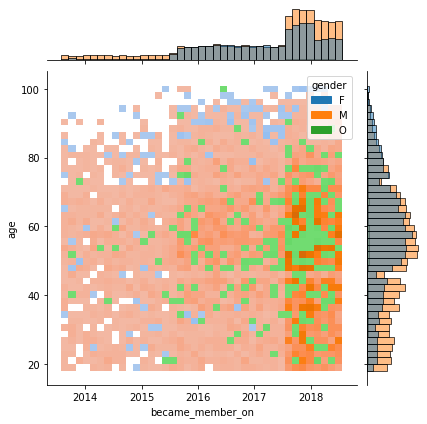
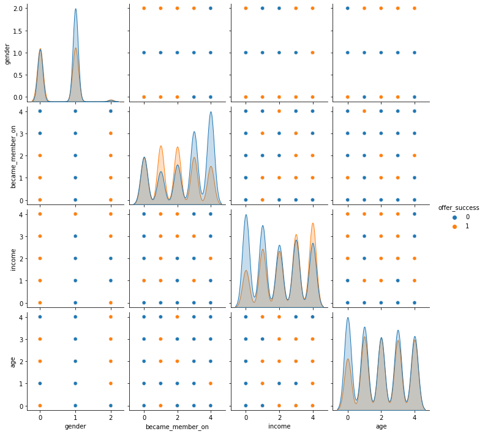
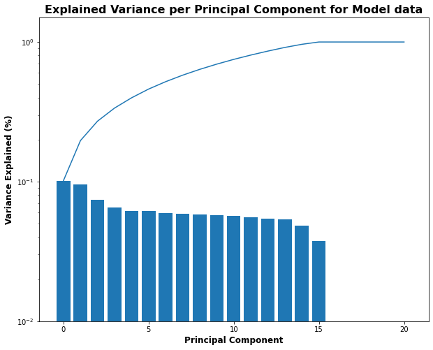
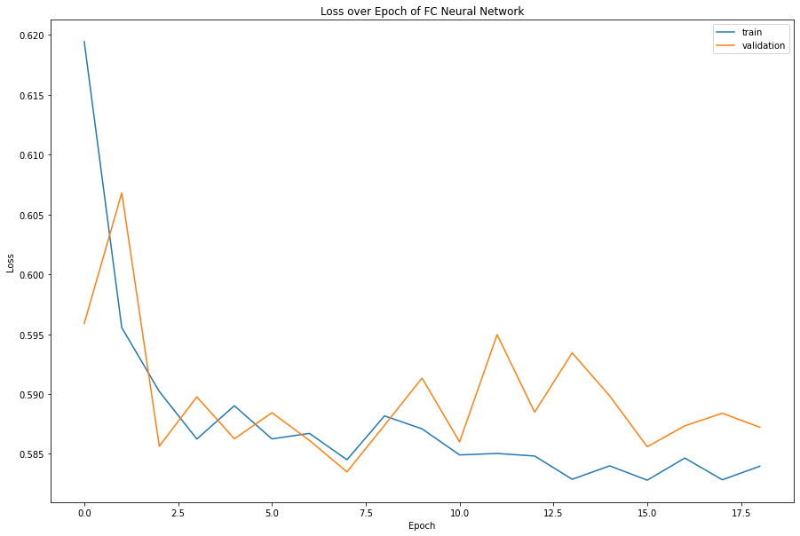

# Optimizing App Offers With Starbucks

***Capstone Proposal for Udacity's Machine Learning Nanodegree**

> **Prepared By:**
>
> Author: Aaron McUmber, Ph.D.
>
> Submission Date: 11 June 2022
>
> **Prepared For:**
>
> Udacity
>
> Machine Learning Engineer Nanodegree

## Table of Contents

- [Optimizing App Offers With Starbucks](#optimizing-app-offers-with-starbucks)
  - [Table of Contents](#table-of-contents)
  - [Definition](#definition)
    - [Project Overview](#project-overview)
    - [Problem Statement](#problem-statement)
    - [Metrics](#metrics)
  - [Analysis](#analysis)
    - [Data Exploration](#data-exploration)
    - [Exploratory Visualization](#exploratory-visualization)
    - [Algorithms and Techniques](#algorithms-and-techniques)
    - [Benchmark](#benchmark)
  - [Methodology](#methodology)
    - [Data Preprocessing](#data-preprocessing)
    - [Refinement](#refinement)
    - [Implementation](#implementation)
  - [Results](#results)
  - [Justification](#justification)
  - [Model Evaluation and Validation](#model-evaluation-and-validation)

## Definition

### Project Overview

Marketing new products and offers is a difficult and critical aspect to any
business endeavor. Well established companies such as Starbucks regularly
require new marketing strategies in order to maintain their customer loyalty
and maintain an advantage ahead of their competition.

Targeting customers with new offers and promotions can have mixed results
depending on the customer's preferences and interests. While some promotions
may encourage increased attendance, other promotions to the same customer base
may not elicit strong responses, or perhaps elicit negative responses.
Building advertising models that are careful to consider customer pervious
habits and demographic information can produce tailored recommendations to
deliver the most effective promotion strategy in an effort to maximize
customer loyalty.

The business case for building effective marketing models are clear, additional
technological implications about time-phased recommendations presents an
interesting challenge to build effective models where a recommendation may
differ depending on timing in addition to a customer's profile.

### Problem Statement

The analysis for this final report has developed predictive models that can
predict if a BOGO offer will be effective provided BOGO offer details as well
as customer profile data.

### Metrics

The models generated will be evaluated using accuracy and against a 
DummyClassifier that will serve as a baseline accuracy. The DummyClassifier 
will select the most frequent class regardless of inputs. This will provide 
insight to any applied bias to the datasets.

## Analysis

### Data Exploration

`Portfolio`
|      | reward | channels                     | difficulty | duration | offer_type    | id                               |
| :--- | :----- | :--------------------------- | :--------- | :------- | :------------ | :------------------------------- |
| 0    | 10     | [email, mobile, social]      | 10         | 7        | bogo          | ae264e3637204a6fb9bb56bc8210ddfd |
| 1    | 10     | [web, email, mobile, social] | 10         | 5        | bogo          | 4d5c57ea9a6940dd891ad53e9dbe8da0 |
| 2    | 0      | [web, email, mobile]         | 0          | 4        | informational | 3f207df678b143eea3cee63160fa8bed |
| 3    | 5      | [web, email, mobile]         | 5          | 7        | bogo          | 9b98b8c7a33c4b65b9aebfe6a799e6d9 |
| 4    | 5      | [web, email]                 | 20         | 10       | discount      | 0b1e1539f2cc45b7b9fa7c272da2e1d7 |

`Transcript`
|      | person                           | event          | value                                            | time |
| :--- | :------------------------------- | :------------- | :----------------------------------------------- | :--- |
| 0    | 78afa995795e4d85b5d9ceeca43f5fef | offer received | {'offer id': '9b98b8c7a33c4b65b9aebfe6a799e6d9'} | 0    |
| 1    | a03223e636434f42ac4c3df47e8bac43 | offer received | {'offer id': '0b1e1539f2cc45b7b9fa7c272da2e1d7'} | 0    |
| 2    | e2127556f4f64592b11af22de27a7932 | offer received | {'offer id': '2906b810c7d4411798c6938adc9daaa5'} | 0    |
| 3    | 8ec6ce2a7e7949b1bf142def7d0e0586 | offer received | {'offer id': 'fafdcd668e3743c1bb461111dcafc2a4'} | 0    |
| 4    | 68617ca6246f4fbc85e91a2a49552598 | offer received | {'offer id': '4d5c57ea9a6940dd891ad53e9dbe8da0'} | 0    |

`Profile`
|      | gender | age  | id                               | became_member_on | income   |
| :--- | :----- | :--- | :------------------------------- | :--------------- | :------- |
| 0    | None   | 118  | 68be06ca386d4c31939f3a4f0e3dd783 | 20170212         | NaN      |
| 1    | F      | 55   | 0610b486422d4921ae7d2bf64640c50b | 20170715         | 112000.0 |
| 2    | None   | 118  | 38fe809add3b4fcf9315a9694bb96ff5 | 20180712         | NaN      |
| 3    | F      | 75   | 78afa995795e4d85b5d9ceeca43f5fef | 20170509         | 100000.0 |
| 4    | None   | 118  | a03223e636434f42ac4c3df47e8bac43 | 20170804         | NaN      |

Data Cleaning

`Portfolio Cleaned`
|      | offer_reward | offer_difficulty | offer_type    | id                               | web  | email | mobile | social | offer_duration |
| :--- | :----------- | :--------------- | :------------ | :------------------------------- | :--- | :---- | :----- | :----- | :------------- |
| 0    | 10           | 10               | bogo          | ae264e3637204a6fb9bb56bc8210ddfd | 0    | 1     | 1      | 1      | 168.0          |
| 1    | 10           | 10               | bogo          | 4d5c57ea9a6940dd891ad53e9dbe8da0 | 1    | 1     | 1      | 1      | 120.0          |
| 2    | 0            | 0                | informational | 3f207df678b143eea3cee63160fa8bed | 1    | 1     | 1      | 0      | 96.0           |
| 3    | 5            | 5                | bogo          | 9b98b8c7a33c4b65b9aebfe6a799e6d9 | 1    | 1     | 1      | 0      | 168.0          |
| 4    | 5            | 20               | discount      | 0b1e1539f2cc45b7b9fa7c272da2e1d7 | 1    | 1     | 0      | 0      | 240.0          |
`Profile Cleaned`
|      | gender | age  | id                               | became_member_on | income   |
| :--- | :----- | :--- | :------------------------------- | :--------------- | :------- |
| 0    | NaN    | NaN  | 68be06ca386d4c31939f3a4f0e3dd783 | 2017-02-12       | NaN      |
| 1    | F      | 55.0 | 0610b486422d4921ae7d2bf64640c50b | 2017-07-15       | 112000.0 |
| 2    | NaN    | NaN  | 38fe809add3b4fcf9315a9694bb96ff5 | 2018-07-12       | NaN      |
| 3    | F      | 75.0 | 78afa995795e4d85b5d9ceeca43f5fef | 2017-05-09       | 100000.0 |
| 4    | NaN    | NaN  | a03223e636434f42ac4c3df47e8bac43 | 2017-08-04       | NaN      |
`Transcript Cleaned`
|      | person                           | event          | time | offer_id                         | reward | amount |
| :--- | :------------------------------- | :------------- | :--- | :------------------------------- | :----- | :----- |
| 0    | 78afa995795e4d85b5d9ceeca43f5fef | offer received | 0    | 9b98b8c7a33c4b65b9aebfe6a799e6d9 | NaN    | NaN    |
| 1    | a03223e636434f42ac4c3df47e8bac43 | offer received | 0    | 0b1e1539f2cc45b7b9fa7c272da2e1d7 | NaN    | NaN    |
| 2    | e2127556f4f64592b11af22de27a7932 | offer received | 0    | 2906b810c7d4411798c6938adc9daaa5 | NaN    | NaN    |
| 3    | 8ec6ce2a7e7949b1bf142def7d0e0586 | offer received | 0    | fafdcd668e3743c1bb461111dcafc2a4 | NaN    | NaN    |
| 4    | 68617ca6246f4fbc85e91a2a49552598 | offer received | 0    | 4d5c57ea9a6940dd891ad53e9dbe8da0 | NaN    | NaN    |

### Exploratory Visualization

### Algorithms and Techniques

### Benchmark

## Methodology

### Data Preprocessing

### Refinement

### Implementation

## Results

## Justification

## Model Evaluation and Validation
