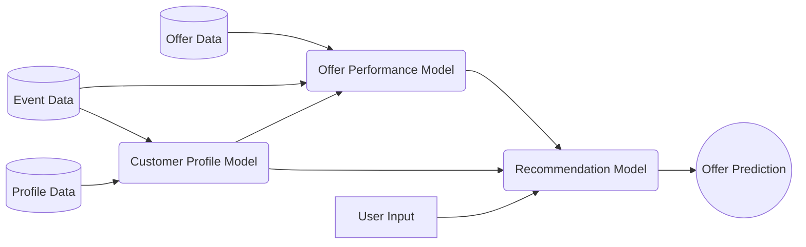
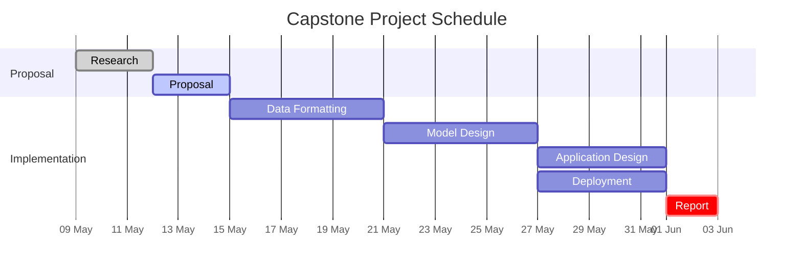

# Optimizing App Offers With Starbucks (R)
### Capstone Proposal for Udacity's Machine Learning Nanodegree

> **Prepared By:**
>
> Author: Aaron McUmber, Ph.D.
>
> Submission Date: 13 May 2022
>
> Email: aime20acm@gmail.com
>
> **Prepared For:**
>
> Udacity
>
> Machine Learning Engineer Nanodegree

## Abstract

This Capstone proposal proposes a notional recommendation model using a
multi-model approach to provide offer recommendations to users based on the
user's profile and behavior. The data used for this model will be customer and
offer data provided by Starbucks in partnership with Udacity. Several data
preprocessing steps will be required to generate features required for each
model and optimizations are expected during the implementation process. The
final product will be a web-based application where a user can input user data
and receive a recommendation. This author recognizes that this interface will
likely change to an in-app solution, but the suggested application provides
additional verification testing to the final model.

## Background

Marketing new products and offers is a difficult and critical aspect to any
business endeavor. Well established companies such as Starbucks regularly
require new marketing strategies in order to maintain their customer loyalty
and maintain an advantage ahead of their competition.

Targeting customers with new offers and promotions can have mixed results
depending on the customer's preferences and interests. While some promotions
may encourage increased attendance, other promotions to the same customer base
may not elicit strong responses, or perhaps elicit negative responses.
Building advertising models that are careful to consider customer pervious
habits and demographic information can produce tailored recommendations to
deliver the most effective promotion strategy in an effort to maximize
customer loyalty.

The business case for building effective marketing models are clear, additional
technological implications about time-phased recommendations presents an 
interesting challenge to build effective models where a recommendation may 
differ depending on timing in addition to a customer's profile.

## Problem Statement

This capstone project is targeted to build a model that can provide 
marketing recommendations to individuals based on personal demographics in
order to maximize customer loyalty while maximizing the return on investment of
the marketing materials used.

## Datasets

The following data was provided by Udacity as a partnership with Starbucks (R).
The data has been anonymized and separated into three datasets formatted using
json. User information is held within `profile.json` and contains 
demographic information about users, such as `gender`, `age`, `id`, 
`became_member_on`, and `income`. The size of `profile.json` include 17,000
entries with 5 fields.

**Field information for `profile.json`**

| Field            | Type          | Description                                   | Null Value |
| :--------------- | :------------ | :-------------------------------------------- | :--------- |
| gender           | categorical   | Gender of user (M, F, or O)                   | null       |
| age              | numeric       | Age of user                                   | 118        |
| id               | string / hash | Unique ID of user                             | N/A        |
| became_member_on | date          | Date user became a member, formatted YYYYMMDD | N/A        |
| income           | numeric       | Estimated income of user                      | null       |

Available offers that are sent during a 30-day test period are held within
`portfolio.json`, containing 10 offers each with 6 fields. Each offer contains
information about the `reward`, `channels`, `difficulty`, `duration`,
`offer_type`, and `id`. Described in the table below.

**Field information for `portfolio.json`**

| Field      | Type                 | Description                                           |
| :--------- | :------------------- | :---------------------------------------------------- |
| reward     | numeric              | Money awarded for the amount spent                    |
| channels   | list[categorical]    | Where offer is available (web, email, mobile, social) |
| difficulty | numeric              | Money required to be spent to receive reward          |
| offer_type | string / categorical | Type of offer (bogo, discount, informational)         |
| id         | string / hash        | Unique ID of offer                                    |

Information regarding key events such as offers received, offers viewed,
transactions made and completed offers are stored in the `transcript.json`
database. This event log contains 306,648 events each with 4 fields, including
`person`, `event`, `value`, `time` data.

**Field information for `transcript.json`**

| Field  | Type                 | Description                                                                                             |
| :----- | :------------------- | :------------------------------------------------------------------------------------------------------ |
| person | string / hash        | Unique ID of user                                                                                       |
| event  | string / categorical | Category of event, (offer received, offer viewed, transaction, offer completed)                         |
| value  | dictionary           | Information dependent on event type including [`offer id`, `amount`, `reward`] described in table below |
| time   | numeric              | Hours after start of test                                                                               |

Event information is held within the `value` field of `transcript.json` and
contains the following information.
* `offer id` : (string / hash) not associated with any "transaction" but
  associated with the offer given to the user during the test
* `amount` : (numeric) money spent in "transaction"
* `reward` : (numeric) money gained from "offer completed" category

## Proposed Solution

In order to produce an effective offer recommendation system, a multi-model
approach is proposed. First, by categorizing customers into profiles and
associating offer strategies to each profile and establishing successful and
unsuccessful strategies to each profile. The final recommendation model will be
evaluated, first if the tested user has data with a provided offer, if not the
model will evaluate success based on customer profile.

## Evaluation Metrics

Accuracy will be the primary metric used to evaluate model final model
performance where accuracy is defined by the ratio between true negative, $TN$,
and true positive, $TP$, to total events, which is the sum of $TN$, $TP$, false
negatives, $FN$, and false positives, $FP$.

$$ Accuracy = \frac{TN + TP}{TN+TP+FN+FP}$$
where, 
$$ TP = True \space Positive,\space TN = True \space Negative$$
$$ FP = False \space Positive,\space FN = False \space Negative$$

Additional metrics of bias and sensitivity were considered. However, due to
the use case for this set of classification algorithms, attention to skew in
performance does not seem necessary at the moment.

## Project Design

Given these three databases, information can be extracted to determine if
offers are effective against specific customer portfolios. This will be done
first by categorizing customers into profiles using unsupervised learning
techniques such as k-means or DBSCAN, with the potential aid of dimensionality 
reduction techniques, such as principal component analysis. This will be known
the profiling model. Once categorized, the effectiveness of offers strategies
will be evaluated compared to each profile, such as time to redeeming an offer
and additional useful metrics such as additional revenue generated by offer.
This will be completed as a combination of data preprocessing and feature
performance evaluation within a performance model.

Once complete a recommendation model can be designed using a supervised
learning classifier such as Neural Network, Gaussian Naive Bayes Classifier, or
Random Forest wil perform offer recommendations based a customer's demographic
information, purchasing history and outputs generated from the categorization
and offer performance models.

The following flow diagram depicts the data flow from one model to another that
will comprise the final composite model:

As a part of the recommendation model solution, an web-based interface will be
generated to allow for a user input information regarding a customer and the
interface will visualize the model prediction and any additional pertinent
information useful to the user. Though, the final model will likely be imbedded
into an existing app such as the Starbucks phone app. This proposed html-facing
application can provide additional debugging and verification interfaces.

In order to maintain task execution to the deadlines provided by Udacity's
machine learning engineer nanodegree course the following schedule is proposed
to maintain an schedule adherence and evaluation.

