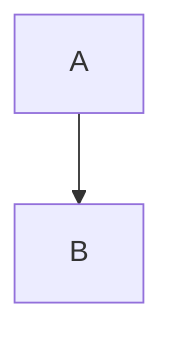
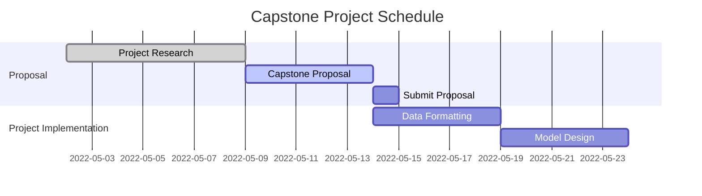

# Optimizing App Offers Wtih Starbucks
### Capstone Proposal for Udacity's Machine Learning Nanodegree

> Author: Aaron McUmber, Ph.D.
>
> Submission Date: 13 May 2022
>
> Email: aime20acm@gmail.com

## Abstract (TBR)

## Domain Background

TODO

## Problem Statement

TODO

## Datasets and Inputs

TODO

## Solution Statement

TODO

## Benchmark Model

TODO

## Evaluation Metrics

TODO

## Project Design

TODO

## Outline

* The project's domain background — the field of research where the project is
  derived;
* A problem statement — a problem being investigated for which a solution will
  be defined;
* The datasets and inputs — data or inputs being used for the problem;
* A solution statement — the solution proposed for the problem given;
* A benchmark model — some simple or historical model or result to compare the
  defined solution to;
* A set of evaluation metrics — functional representations for how the solution
  can be measured;
* An outline of the project design — how the solution will be developed and
  results obtained.

## Rubric

### Domain Background

Student briefly details background information of the domain from which the project is proposed. Historical information relevant to the project should be included. It should be clear how or why a problem in the domain can or should be solved. Related academic research should be appropriately cited. A discussion of the student's personal motivation for investigating a particular problem in the domain is encouraged but not required.

### Problem Statement

Student clearly describes the problem that is to be solved. The problem is well defined and has at least one relevant potential solution. Additionally, the problem is quantifiable, measurable, and replicable.

### Datasets and Inputs

The dataset(s) and/or input(s) to be used in the project are thoroughly described. Information such as how the dataset or input is (was) obtained, and the characteristics of the dataset or input, should be included. It should be clear how the dataset(s) or input(s) will be used in the project and whether their use is appropriate given the context of the problem.

### Solution Statement

Student clearly describes a solution to the problem. The solution is applicable to the project domain and appropriate for the dataset(s) or input(s) given. Additionally, the solution is quantifiable, measurable, and replicable.

### Benchmark Model

A benchmark model is provided that relates to the domain, problem statement, and intended solution. Ideally, the student's benchmark model provides context for existing methods or known information in the domain and problem given, which can then be objectively compared to the student's solution. The benchmark model is clearly defined and measurable.

### Evaluation Metrics

Student proposes at least one evaluation metric that can be used to quantify the performance of both the benchmark model and the solution model presented. The evaluation metric(s) proposed are appropriate given the context of the data, the problem statement, and the intended solution.

### Project Design

Student summarizes a theoretical workflow for approaching a solution given the problem. Discussion is made as to what strategies may be employed, what analysis of the data might be required, or which algorithms will be considered. The workflow and discussion provided align with the qualities of the project. Small visualizations, pseudocode, or diagrams are encouraged but not required.

### Presentation

Proposal follows a well-organized structure and would be readily understood by its intended audience. Each section is written in a clear, concise and specific manner. Few grammatical and spelling mistakes are present. All resources used and referenced are properly cited.

## References (TBR)